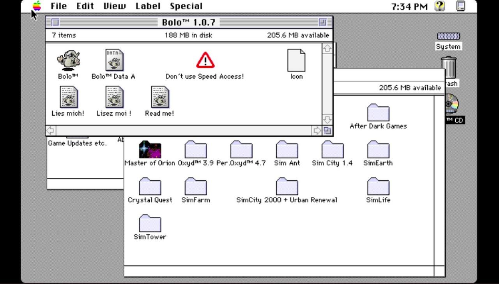

Overview
=====

This is a release of MeetPatty’s Basilisk II Mac Emulator for Vita with the changes listed below. My earlier changes to 0.32 have already been incorporated into the upstream repository.



Thanks to MeetPatty for an amazing port of this emulator.

Thanks to my supporters on Patreon: Andyways, CountDuckula, and Sean Ritzo.

This release is for anyone who wants to try it out in the meantime before MeetPatty releases a new official version.

Indirect touch controls can now be enabled in the menu.

Indirect Touch Controls
=====

Indirect touch controls are always used on the rear panel. On the front panel, the default is to use direct touch (pointer jumps to finger), but indirect controls can be enabled in the menu. 

For multi-touch gestures, the fingers have to be far enough apart from each other, so that the Vita will not erroneously recognize them as a single finger. Otherwise the pointer will jump around.

- Single finger drag: move the mouse pointer, how far the pointer moves in response to finger motion depends on the Mouse Speed setting
- Single finger short tap: left mouse button. 
- One finger short tap while holding another finger: right mouse button. 
- Long second finger tap while holding another finger: initiate left mouse button drag and drop, useful to hold left button down to bring up menus. 
- Long third finger tap while holding two other fingers: initiate right mouse button drag and drop. Drag and drop stops when last finger is released.

Basilisk II for the Vita
=======

Basilisk II is a multi-platform Mac II emulator whose code is released under the terms of the
GPL v2.

Features for the Vita version include:

* Emulates a Mac II series machine running OS 7.0.1 through 8.1, depending on the ROM used.
* Uses UAE CPU emulation, with new SoftFloat FPU emulation for better compatibility.
* Supports on-the-fly change of colors and resolution (requires Display Manager).
* Has stereo, 16-bit, 44kHz audio (requires Sound Manager 3.0).
* Supports emulated floppy and CDROM with removable media (no CD audio yet).
* Supports up to four hardfiles for use as fixed drives.
* Emulates a Mac Extended ADB keyboard and mouse. Buttons can be remapped on-the-fly.
* Bluetooth keyboard and mouse support.
* On-screen overlay keyboard that controlled with Vita buttons.
* Analog joystick pointer movement with adjustable speed and deadzone
* Touch pointer controls (front/rear panel) with gestures and selectable direct/indirect mode

The main Basilisk II website is located at http://basilisk.cebix.net/. This version of Basilisk II
is based on Chilly Willy's PSP port v1.1.1.

Basilisk II comes with ABSOLUTELY NO WARRANTY. This is free software, and you are welcome to
redistribute it under the terms of the GNU General Public License.

Installing Basilisk II for the Vita
===================================

Install the vpk in the usual way. Copy the Basilisk II folder in the archive to ux0:data.  
If you look at the folder, you'll see the following:  

(directories)  
cdroms  
disks  
files  
hardfiles  
imaps  
roms  

(files)  
BasiliskII_prefs  
imaps/default  
imaps/dpad_mouse  

The cdroms folder is where you copy the bin/cue dumps of Mac CDROMs you wish to use with the
emulation. These should be standard MODE1 ISO dumps, not raw dumps. The extension for CDROM
images are normally “.bin”, “.iso”, or “.img”.

The disks folder is where you copy floppy images you wish to use with the emulation. These are
plain dumps of 1.44 MB high-density Mac or PC format microfloppy disks. PC format requires the
appropriate Mac extension to read, such as MacLink (part of OS 8). All files in this folder
should have an extension of “.dsk”.

The files folder is mounted on the Mac desktop when enabled in the settings. Files in this folder
should be in AppleDouble, hqx, and binhex format.

The hardfiles folder contains the files that are used as fixed hard disks in the emulation. They
can be virtually any size, but will generally be between 200 and 400 MB as a basic installation
of OS8 takes about 120 MB. You can have any number of files in this directory, but only a maximum
of four can be selected at one time. The extension of files in this folder should b “.hfv”, but may
also have no extension at all.

The imaps folder holds the input maps for remapping the Vita buttons into Mac input events. This will
be explained later.

The roms folder holds the Mac ROM images you might use with the emulation. You select one image in
the emulation setup. They can have any file name, but a typical extension is “.rom”.

BasiliskII_prefs is a sample preferences file.

Note: No Apple Macintosh ROMs or software of any sort is included with this program. You'll have to
find them yourself. This emulator is useless without a ROM and MacOS.

Controls
========
SELECT - Invoke the imap/floppy/cdrom menu  

While in the imap/floppy/cdrom menu, you press up/down to change between input maps,
floppies, and cdroms. Press left/right to browse the list of files in the imaps, disks, and
cdroms directories, respectively. Press CROSS to select an input map, or mount a CD-ROM or
floppy. Press SELECT again to exit the menu. Note that you can only have one cd-rom and
floppy mounted at a time. To mount another, you must first dismount the CD-ROM/floppy
which is already mounted. On the Mac, you dismount disks/cd-roms by throwing them in the
trash, or by selecting the disk and then selecting Eject from the Special menu (or pressing
the Command + E keys).

Default Controls
================
CROSS – mouse button  
SQUARE – enter key  
CIRCLE – command + w (Close Window)  
TRIANGLE – command + q (Quit Application)  
RTRIGGER – control key  
LTRIGGER – option key  
UP/DOWN/LEFT/RIGHT – corresponding cursor key  
ANALOG STICK – mouse  

dpad_mouse Controls
===================
CROSS – mouse button  
SQUARE – enter key  
CIRCLE – command + w (Close Window)  
TRIANGLE – command + q (Quit Application)  
RTRIGGER – control key  
LTRIGGER – move mouse faster  
UP/DOWN/LEFT/RIGHT – mouse  
ANALOG STICK – mouse  

Bluetooth mouse / keyboard controls
=================
Real Bluetooth keyboard and mice also work. This was tested working with Jelly Bean BT keyboard and mouse combo ASIN:B06Y56BBYP and with the standalone Jelly Comb Bluetooth Wireless Mouse ASIN:B075HBDWCF. Vita and VitaTV do not pair with all BT keyboards or mice, some work, some don't.

Imap file format
================

Each line has the following format:

<vita key(s) pressed> <vita key(s) not pressed> <mac key 1> <mac key 2> <mac key 3> <mac key 4>

Lines starting with # are treated as comment lines and ignored,

Valid vita key values are (OR keys to combine):

0x0000  No key  
0x0008	Start button.  
0x0010	Up D-Pad button.  
0x0020	Right D-Pad button.  
0x0040	Down D-Pad button.  
0x0080	Left D-Pad button.  
0x0100	Left trigger.  
0x0200	Right trigger.  
0x1000	Triangle button.  
0x2000	Circle button.  
0x4000	Cross button.  
0x8000	Square button.  

See below for Basilisk II key codes

Example D-Pad Up = cursor up: 

0x0010 0x0000 62 255 255 255

Example Triangle = command + q: 

0x1000 0x0000 55 12 255 255

See imaps/default and imaps/dpad_mouse for further examples

Basilisk II Key Codes
=====================
````	
0       A	
1       S	
2       D	
3       F	
4       H	
5       G	
6       Z	
7       X	
8       C	
9       V	
11      B	
12      Q	
13      W	
14      E	
15      R	
16      Y	
17      T	
18      1	
19      2	
20      3	
21      4	
22      6	
23      5	
24      =	
25      9	
26      7	
27      -	
28      8	
29      0	
30      ]	
31      O	
32      U	
33      [	
34      I	
35      P	
36      Return	
37      L	
38      J	
39      '	
40      K	
41      ;	
42      \	
43      ,	
44      /	
45      N	
46      M	
47      .	
48      Tab	
49      Space	
50      `	
51      Backspace	
53      Esc	
54      Ctrl Left	
55      Alt Left (-> Command)	
56      Shift Left	
57      Caps Lock	
58      Logo Left (-> Option)	
59      Cursor Left	
60      Cursor Right	
61      Cursor Down	
62      Cursor Up	
65      KP .	
67      KP *	
69      KP +	
71      Num Lock	
75      KP /	
76      KP Enter	
78      KP -	
82      KP 0	
83      KP 1	
84      KP 2	
85      KP 3	
86      KP 4	
87      KP 5	
88      KP 6	
89      KP 7	
91      KP 8	
92      KP 9	
96      F5	
97      F6	
98      F7	
99      F3	
100     F8	
101     F9	
103     F11	
105     PrintScrn	
107     Scroll Lock	
109     F10	
111     F12	
113     Pause	
114     Insert	
115     Home	
116     Page Up	
117     Delete	
118     F4	
119     End	
120     F2	
121     Page Down	
122     F1
255     No key press
256     Mouse button 1
`````

Changelog 
-----------
0.33f

- improve pointer response to diagonal stick directions

0.33e

- remove bluetooth mouse lag
- apply pointer speed setting also to bluetooth mouse

0.33d

- prevent accidental clicks when moving pointer using rear touch or indirect front touch

0.33c

- implemented rear touch (can be enabled in options)
- implemented indirect front touch (can be enabled in options) 
- implemented pointer speed option
- implemented radial scaled analog joystick deadzone
- added cpu speed option to max out all frequencies (CPU, GPU and BUS) for maximum speed

0.33b

- now uses the full analog joystick range of the Vita

0.33a

- attempt to reduce bluetooth mouse lag (hard to tell if it helped)
- re-compiled with latest source from MeetPatty, which includes support of uma0:

0.32c
- bugfix with new 640x400 resolution (was added to internal list of modes twice)

0.32b
- add 640x400 resolution option
- improve picture quality for resolutions where mac pixels do not map 1:1 onto vita pixels. Pixels are much less distorted now in those cases.
- add aspect ratio option "square pixels," useful to achieve a larger display of some fullscreen games without distortion. For example fullscreen games that run in 640x400 fit the Vita screen pretty well, even without stretching.

The System 7 resolution setting has a higher priority than the Basiliskii settings. So, to change resolution, it is not enough to only change it in the Basilisk prefs. The resolution has to be changed also in the "monitors" extension in system 7. Otherwise, the os will set it back during boot.

0.32a
- more keys accessible in the Danzeff OSK. 
- highlight qualifier keys selected with "select" when OSK is displayed
